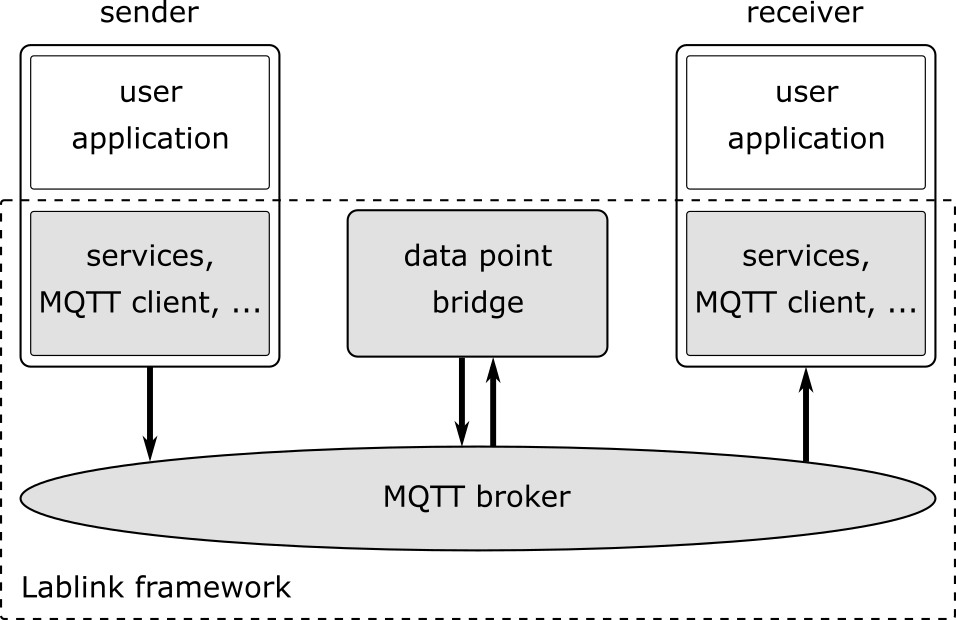
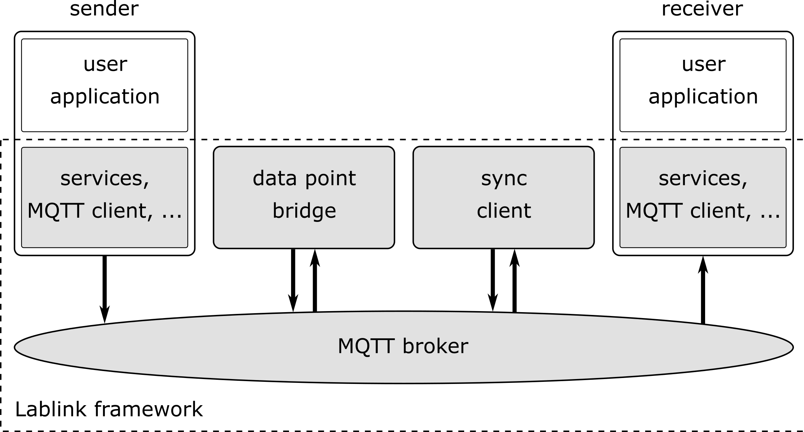
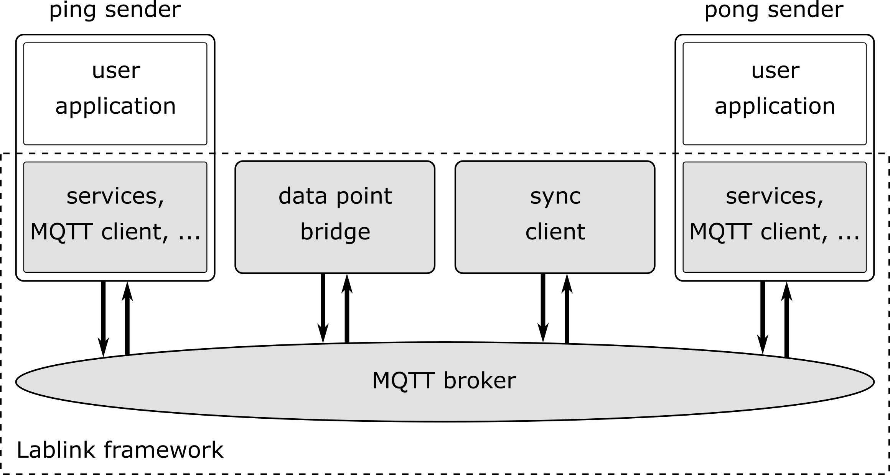

Example 1: HelloWorld
=====================

About
-----

The first example demonstrates the basic functionality of a Lablink client:

* basic client setup
* data service setup (class *HelloWorldData*)
* definition of state change notifications (via class *HelloWorldNotifier*, an anonymous class and as lambda expression)
* running the client and sending/retrieving data (hello world messages)
* interacting with the Lablink client shell

The source code can be found in file :github_blob:`HelloWorld.java <src/main/java/at/ac/ait/lablink/examples/helloworld/HelloWorld.java>` in the sources subfolder :github_tree:`src/main/java/at/ac/ait/lablink/examples/helloworld`.

Running the example
-------------------

Execute script :github_blob:`helloworld.cmd <scripts/1_helloworld/helloworld.cmd>` in subfolder :github_tree:`scripts/1_helloworld`, either from the command prompt or by double-click.

Expected results
----------------

Running the example will produce quite a lot of output in the console, because the logger is configured to display all messages with category INFO.
Among other messages, you should see something similar to this:

.. code-block:: none

    13:31:21.509 [main] INFO  HelloWorld - service name: Say HELLO to the world!
    13:31:21.510 [main] INFO  LlServiceBase - HelloWorldDataService: set new value to 'Hello world!'
    13:31:21.513 [main] INFO  HelloWorld - HelloWorldDataService: notifier -> state Changed from '' to 'Hello world!'
    13:31:21.514 [main] INFO  HelloWorld - HelloWorldDataService: another notifier -> state changed from '' to 'Hello world!'
    13:31:21.514 [main] INFO  HelloWorld - HelloWorldDataService: yet another notifier -> state changed from '' to 'Hello world!'
    13:31:21.522 [main] INFO  HelloWorld - service value: Hello world!
    13:31:21.522 [main] INFO  LlServiceBase - HelloWorldDataService: set new value to 'Hello again!'
    13:31:21.523 [main] INFO  HelloWorld - HelloWorldDataService: notifier -> state Changed from 'Hello world!' to 'Hello again!'
    13:31:21.523 [main] INFO  HelloWorld - HelloWorldDataService: another notifier -> state changed from 'Hello world!' to 'Hello again!'
    13:31:21.524 [main] INFO  HelloWorld - HelloWorldDataService: yet another notifier -> state changed from 'Hello world!' to 'Hello again!'
    13:31:21.524 [main] INFO  HelloWorld - Service value set successfully.
    13:31:21.525 [main] INFO  LlServiceBase - HelloWorldDataService: set new value to 'Hello once more!'
    13:31:21.525 [main] INFO  HelloWorld - HelloWorldDataService: notifier -> state Changed from 'Hello again!' to 'Hello once more!'
    13:31:21.525 [main] INFO  HelloWorld - HelloWorldDataService: another notifier -> state changed from 'Hello again!' to 'Hello once more!'
    13:31:21.526 [main] INFO  HelloWorld - HelloWorldDataService: yet another notifier -> state changed from 'Hello again!' to 'Hello once more!'
    13:31:21.527 [main] INFO  HelloWorld - Service value set again successfully.
    13:31:21.527 [main] INFO  HelloWorld - Hello once more!

These messages stem from the programmatic interaction with the client and its data service (class *HelloWorldData*) at the end of the main routine in file :github_blob:`HelloWorld.java <src/main/java/at/ac/ait/lablink/examples/helloworld/HelloWorld.java>`.
Once the instructions from the main routine are executed, the client remains in running state.
To interact with it, you can use the **Lablink client shell**.
For examples, you can enter `?l` to list the available commands and explore further:

.. code-block:: doscon

    llclient> ?l
    abbrev  name    params
    gn      get-name        ()
    gsv     get-srvc-val    (service-name)
    gp      get-prot        ()
    gd      get-desc        ()
    gst     get-srvc-type   (service-name)
    fgsv    get-srvc-val    ()
    svd     set-srvc-val-dbl        (service-name, value-double)
    svl     set-srvc-val-lng        (service-name, value-long)
    ssn     set-srvc-name   (service-name)
    gyp     get-ypage       ()
    svb     set-srvc-val-bol        (service-name, boolean-val)
    svs     set-srvc-val-str        (service-name, string-val)
    ls      list-srvc       ()
    lsp     list-srvc-prop  ()
    sd      new-set-srvc-val-dbl    (service-name, value-double)
    lps     list-srvc-psudo ()
    lpsp    list-psudo-srvc-prop    ()
    
    llclient> gd
    A simple client to demonstrate the basic usage.
    
    llclient> ls
    Name            DataType                State
    HelloWorldDataService   String  Hello once more!
    Found 1 registered service(s).

Example 2a: Asynchronous Ping
=============================

About
-----

The second example demonstrates how data (ping message) can be sent from one client (sender) to another client (receiver) with the help of the **datapoint bridge** service.
This example shows how this can be done **asynchronously** in real-time.
The next example (example 2b) shows how the same thing can be achieved by synchronizing the execution of the two clients.

The source code of the clients implementing the sender and the receiver can be found in file :github_blob:`PingSenderAsync.java <src/main/java/at/ac/ait/lablink/examples/ping/async/PingSenderAsync.java>` and file :github_blob:`PingReceiverAsync.java <src/main/java/at/ac/ait/lablink/examples/ping/async/PingReceiverAsync.java>`, respectively.
Both are located in the sources subfolder :github_tree:`src/main/java/at/ac/ait/lablink/examples/ping/async`.
The configuration of the datapoint bridge is stored in the configuration server under the ID `ait.example.ping.async.dpb.config <http://localhost:10101/view?id=ait.example.ping.async.dpb.config>`_.

Running the example
-------------------

All relevant scripts can be found in subfolder :github_tree:`scripts/2_ping/2a_async`.
To run the example, execute all scripts either in separate command prompt windows or by double-clicking:

* :github_blob:`dpb_async.cmd <scripts/2_ping/2a_async/dpb_async.cmd>`: runs the datapoint bridge service, connecting the sender and the receiver
* :github_blob:`sender_async.cmd <scripts/2_ping/2a_async/sender_async.cmd>`: runs the sender, which will send data (ping message) to the receiver
* :github_blob:`receiver_async.cmd <scripts/2_ping/2a_async/receiver_async.cmd>`: runs the receiver, which will wait and listen for incoming data (ping message)

The order in which the scripts are started is in principle arbitrary.
However, the receiver will obviously not receive any ping messages before the sender AND the datapoint bridge have started.

**HINT**:
As long as the datapoint bridge is running, the clients can be started, stopped and re-started and they will still re-connect.
Feel free to experiment!

Expected results
----------------

In case you start the datapoint bridge first, but not yet the sender and the receiver, you should see messages similar to the follwing:

.. code-block:: none

    ...
    2020-02-06 13:32:41.735 [ConsumerStatus] INFO  DatapointBridge - Checking consumer status...
    2020-02-06 13:32:41.736 [ConsumerStatus] DEBUG DatapointBridge - Consumer PingOut is NOT_CONNECTED
    2020-02-06 13:32:41.736 [ConsumerStatus] DEBUG DatapointBridge - Consumer PingIn is NOT_CONNECTED
    ...

Once you start the clients, you should see something similar to the following:

.. code-block:: none

    ...
    2020-02-06 13:33:25.445 [pool-2-thread-3] DEBUG at.ac.ait.lablink.core.services.datapoint.consumer.DataPointConsumerGeneric - Datapoint [PingReceiverService, PingReceiverService] status update CONNECTED
    2020-02-06 13:33:25.445 [pool-2-thread-3] INFO  ConsumerString - PingIn has changed it state to: CONNECTED
    ...         3:33
    2020-02-06 13:33:25.447 [pool-2-thread-3] DEBUG at.ac.ait.lablink.core.services.datapoint.consumer.DataPointConsumerGeneric - Datapoint [PingSenderService, PingSenderService] status update CONNECTED
    2020-02-06 13:33:25.448 [pool-2-thread-3] INFO  ConsumerString - PingOut has changed it state to: CONNECTED  PING#0
    ...

The sender continuously sends ping messages every 4 seconds:

.. code-block:: none

    ...
    13:34:42.878 [pool-2-thread-1] INFO  PingSenderAsync - PingSenderService: value changed from 'PING#1' to 'PING#2'
    13:34:42.878 [pool-2-thread-1] INFO  PingSenderAsync - ping message sent
    13:34:46.878 [pool-2-thread-1] INFO  PingSenderAsync - PingSenderService: value changed from 'PING#2' to 'PING#3'
    13:34:46.878 [pool-2-thread-1] INFO  PingSenderAsync - ping message sent
    13:34:50.880 [pool-2-thread-1] INFO  PingSenderAsync - PingSenderService: value changed from 'PING#3' to 'PING#4'
    13:34:50.880 [pool-2-thread-1] INFO  PingSenderAsync - ping message sent
    ...

Accordingly, the receiver should get a new ping message every 4 seconds (compare the time stamps):

.. code-block:: none

    ...
    13:34:42.881 [pool-2-thread-1] INFO  PingReceiverAsync - PingReceiverService: value changed from 'PING#1' to 'PING#2'
    13:34:46.882 [pool-2-thread-1] INFO  PingReceiverAsync - PingReceiverService: value changed from 'PING#2' to 'PING#3'
    13:34:50.884 [pool-2-thread-1] INFO  PingReceiverAsync - PingReceiverService: value changed from 'PING#3' to 'PING#4'
    ...

Example 2b: Synchronized Ping
=============================

About
-----

This example is similar to the previous (example 2a), only that the clients do not run asynchronously but are synchronized by a special Lablink client called **sync host**.
To interact with the sync host, each client implements a **sync consumer**, whose ``go`` method is called at every synchronization point.
This allows to run the example in **simulation mode**, where the clients are synchronized against a logical time rather than wall-clock time.
More details on this topic can be found `here <https://ait-lablink.readthedocs.io/projects/lablink-sync-host>`_.

The source code of the sender (:github_blob:`PingSenderSync.java <src/main/java/at/ac/ait/lablink/examples/ping/sync/PingSenderSync.java>`), the receiver (:github_blob:`PingReceiverSync.java <src/main/java/at/ac/ait/lablink/examples/ping/sync/PingReceiverSync.java>`) and the sync consumer (:github_blob:`PingSyncConsumer.java <src/main/java/at/ac/ait/lablink/examples/ping/sync/PingSyncConsumer.java>`) can be found in the sources subfolder :github_tree:`src/main/java/at/ac/ait/lablink/examples/ping/sync`.

The configuration server has two entries stored that are relevant for this example:

* `ait.example.ping.sync.sync-host.properties <http://localhost:10101/view?id=ait.example.ping.sync.sync-host.properties>`_: sync host properties
* `ait.example.ping.sync.dpb.config <http://localhost:10101/view?id=ait.example.ping.sync.dpb.config>`_: datapoint bridge configuration

The sync host scenario configuration (as specified by *syncHost.syncScenarioFile* in the `sync host properties <http://localhost:10101/view?id=ait.example.ping.sync.sync-host.properties>`__) can be found in file :github_blob:`sync_config_ping.json <scripts/2_ping/2b_sync/sync_config_ping.json>` in subfolder :github_tree:`scripts/2_ping/2b_sync`.

**HINT**:
You can switch the default execution mode from simulation to emulation (real-time execution), by changing the attribute ``simMode`` from ``SIM`` to ``EMU`` in file :github_blob:`sync_config_ping.json <scripts/2_ping/2b_sync/sync_config_ping.json>`.

Running the example
-------------------

All relevant scripts can be found in subfolder :github_tree:`scripts/2_ping/2b_sync`.
To run the example, execute all scripts either in separate command prompt windows or by double-clicking:

* :github_blob:`dpb_sync.cmd <scripts/2_ping/2b_sync/dpb_sync.cmd>`: runs the datapoint bridge service, connecting the sender and the receiver
* :github_blob:`sender_sync.cmd <scripts/2_ping/2b_sync/sender_sync.cmd>`: runs the sender, which will send data (ping message) to the receiver whenever instructed by the sync host
* :github_blob:`receiver_sync.cmd <scripts/2_ping/2b_sync/receiver_sync.cmd>`: runs the receiver, which will wait and listen for incoming data (ping message)
* :github_blob:`sync_host_ping.cmd <scripts/2_ping/2a_async/sync_host_ping.cmd>`: runs the sync host, which starts the periodically synchronized execution of the ``go`` method of the clients' sync consumers 

Start the datapoint bridge and the clients first (in arbitrary order).
**Before you start the sync host**, make sure that the **clients are already connected to the datapoint bridge** (check status messages of datapoint bridge).

Expected results
----------------

In case you start the sync host before you start the sender and the receiver (and their sync consumers), it will wait for them:

.. code-block:: none

    ...
    2020-02-06T13:36:16,650 WARN [pool-3-thread-1] at.ac.ait.lablink.core.services.sync.SyncHostServiceImpl:
    Needed sync participant PingDemo PingSenderSync didn't answer yet. Trying a new check in 3000 seconds ...
    2020-02-06T13:36:16,650 WARN [pool-3-thread-1] at.ac.ait.lablink.core.services.sync.SyncHostServiceImpl:
    Needed sync participant PingDemo PingReceiverSync didn't answer yet. Trying a new check in 3000 seconds ...
    ...

Once the sender AND the receiver are running, the sync host will start with the simulation:

.. code-block:: none

    ...
    2020-02-06T13:36:25,670 INFO [pool-2-thread-2] at.ac.ait.lablink.core.services.sync.SyncHostServiceImpl:
    New SyncClient is registered: PingDemo PingReceiverSync
    2020-02-06T13:36:25,671 INFO [pool-2-thread-1] at.ac.ait.lablink.core.services.sync.SyncHostServiceImpl:
    New SyncClient is registered: PingDemo PingSenderSync
    2020-02-06T13:36:28,658 INFO [pool-3-thread-1] at.ac.ait.lablink.core.services.sync.SyncHostServiceImpl: Change SyncHost State to SIMULATING
    2020-02-06T13:36:28,662 INFO [pool-2-thread-1] at.ac.ait.lablink.core.services.sync.consumer.SyncClientServiceImpl:
    Reading configuration parameters from SyncParamMessage{scenario='ping_20200206_141928', mode='SIMULATION', simBeginTime=0, simEndTime=10000, scaleFactor=1, stepSize=2000}
    2020-02-06T13:36:28,665 INFO [pool-3-thread-1] at.ac.ait.lablink.core.services.sync.SyncHostServiceImpl:
    Starting SIMULATION: 01.01.1970 00:00:00-01.01.1970 00:00:10, Step: 2000 ms; Scale: 1!
    2020-02-06T13:36:28,681 INFO [pool-3-thread-1] at.ac.ait.lablink.core.services.sync.SyncHostServiceImpl:
    Finished Simulation
    2020-02-06T13:36:28,683 INFO [pool-3-thread-1] at.ac.ait.lablink.core.services.sync.SyncHostServiceImpl:
    Change SyncHost State to STOPPED
    ...

Once the simulation starts, the sender (or actually its sync consumer) will be periodically called by the sync host.
Please note that in simulation mode there is no correlation between wall-clock time and the logical time (with which the sync consumer is called):

.. code-block:: none

    ...
    13:36:28.667 [pool-2-thread-1] INFO at.ac.ait.lablink.examples.ping.sync.PingSyncConsumer - synchronization point at 0
    13:36:28.667 [pool-2-thread-1] INFO PingSenderSync - PingSenderService: Value changed from '' to 'PING#0'
    13:36:28.670 [pool-2-thread-1] INFO PingSyncConsumer - synchronization point at 2000
    13:36:28.670 [pool-2-thread-1] INFO PingSenderSync - PingSenderService: Value changed from 'PING#0' to 'PING#1'
    13:36:28.672 [pool-2-thread-1] INFO PingSyncConsumer - synchronization point at 4000
    13:36:28.675 [pool-2-thread-1] INFO PingSenderSync - PingSenderService: Value changed from 'PING#1' to 'PING#2'
    13:36:28.677 [pool-2-thread-1] INFO PingSyncConsumer - synchronization point at 6000
    13:36:28.678 [pool-2-thread-1] INFO PingSenderSync - PingSenderService: Value changed from 'PING#2' to 'PING#3'
    13:36:28.679 [pool-2-thread-1] INFO PingSyncConsumer - synchronization point at 8000
    13:36:28.680 [pool-2-thread-1] INFO PingSenderSync - PingSenderService: Value changed from 'PING#3' to 'PING#4'
    ...

The same goes for the receiver:

.. code-block:: none

    ...
    13:36:28.670 [pool-2-thread-1] INFO PingReceiverSync - PingReceiverService: Value changed from '' to 'PING#0'
    13:36:28.670 [pool-2-thread-2] INFO PingSyncConsumer - synchronization point at 2000
    13:36:28.671 [pool-2-thread-2] INFO PingReceiverSync - PingReceiverService: Value changed from 'PING#0' to 'PING#1'
    13:36:28.672 [pool-2-thread-1] INFO PingSyncConsumer - synchronization point at 4000
    13:36:28.677 [pool-2-thread-1] INFO PingReceiverSync - PingReceiverService: Value changed from 'PING#1' to 'PING#2'
    13:36:28.677 [pool-2-thread-1] INFO PingSyncConsumer - synchronization point at 6000
    13:36:28.679 [pool-2-thread-1] INFO PingReceiverSync - PingReceiverService: Value changed from 'PING#2' to 'PING#3'
    13:36:28.679 [pool-2-thread-2] INFO PingSyncConsumer - synchronization point at 8000
    13:36:28.681 [pool-2-thread-2] INFO PingReceiverSync - PingReceiverService: Value changed from 'PING#3' to 'PING#4'
    ...

Example 3a: Asynchronous Ping Pong
==================================

About
-----

This examples extends example 2a by sending a return message (pong message) after a ping message has been received.
It comprises two clients, which are both a sender and a receiver.
One client periodically sends ping messages and waits to receive pong messages (ping sender).
The other clients waits for ping messages and in return sends delayed pong messages (pong sender).
This example shows how this can be done **asynchronously** in real-time.
The next example (example 3b) shows how the same thing can be achieved by synchronizing the execution of the two clients.

.. image:: img/example_3a.png
   :align: center
   :alt: Lablink Example 3a: Asynchronous Ping Pong

The source code of the two clients can be found in file :github_blob:`PingSenderAsync.java <src/main/java/at/ac/ait/lablink/examples/pingpong/async/PingSenderAsync.java>` and file :github_blob:`PongSenderAsync.java <src/main/java/at/ac/ait/lablink/examples/pingpong/async/PongSenderAsync.java>`, respectively. Both are located in the sources subfolder :github_tree:`src/main/java/at/ac/ait/lablink/examples/pingpong/async`.
The configuration of the datapoint bridge is stored in the configuration server under the ID `ait.example.pingpong.async.dpb.config <http://localhost:10101/view?id=ait.example.pingpong.async.dpb.config>`_.

Running the example
-------------------

All relevant scripts can be found in subfolder :github_tree:`scripts/3_pingpong/3a_async`.
To run the example, execute all scripts either in separate command prompt windows or by double-clicking:

* :github_blob:`dpb_pingpong_async.cmd <scripts/3_pingpong/3a_async/dpb_pingpong_async.cmd>`: runs the datapoint bridge service, connecting the clients
* :github_blob:`sender_ping_async.cmd <scripts/3_pingpong/3a_async/sender_ping_async.cmd>`: runs the ping sender, which will send data (ping message) and then waits for return data (pong message)
* :github_blob:`sender_pong_async.cmd <scripts/3_pingpong/3a_async/sender_pong_async.cmd>`: runs the pong sender, which will wait and listen for incoming data (ping message) and send delayed return data (pong message)

The order in which the scripts are started is in principle arbitrary.
However, the clients will obviously not send/receive any messages before the both clients AND the datapoint bridge have started.

**HINT**:
As long as the datapoint bridge is running, the clients can be started, stopped and re-started and they will still re-connect.
Feel free to experiment!

Expected results
----------------

The ping sender sends every 4 seconds a ping message.
As intended, it receives around 2 seconds later a pong message in return (see timestamps):

.. code-block:: none

    ...
    13:38:39.920 [pool-2-thread-1] INFO  PingSenderAsync - PingSenderService: value changed from 'PING#0' to 'PING#1'
    13:38:39.920 [pool-2-thread-1] INFO  PingSenderAsync - ping message sent
    13:38:41.926 [pool-3-thread-1] INFO  PingSenderAsync - PongReceiverService: value changed from 'PONG#0' to 'PONG#1'
    13:38:43.922 [pool-2-thread-1] INFO  PingSenderAsync - PingSenderService: value changed from 'PING#1' to 'PING#2'
    13:38:43.923 [pool-2-thread-1] INFO  PingSenderAsync - ping message sent
    13:38:45.935 [pool-3-thread-1] INFO  PingSenderAsync - PongReceiverService: value changed from 'PONG#1' to 'PONG#2'
    13:38:47.920 [pool-2-thread-1] INFO  PingSenderAsync - PingSenderService: value changed from 'PING#2' to 'PING#3'
    13:38:47.920 [pool-2-thread-1] INFO  PingSenderAsync - ping message sent
    13:38:49.926 [pool-3-thread-1] INFO  PingSenderAsync - PongReceiverService: value changed from 'PONG#2' to 'PONG#3'
    ...

The pong sender receives every 4 seconds a ping message and schedules a pong message with 2 seconds delay (see timestamps):

.. code-block:: none

    ...
    13:38:39.923 [pool-3-thread-1] INFO  PongSenderAsync - PingReceiverService: value changed from 'PING#0' to 'PING#1'
    13:38:39.923 [pool-3-thread-1] INFO  PongSenderAsync - schedule new pong message to be sent in 2000 ms
    13:38:41.924 [pool-2-thread-1] INFO  PongSenderAsync - PongSenderService: value changed from 'PONG#0' to 'PONG#1'
    13:38:41.924 [pool-2-thread-1] INFO  PongSenderAsync - pong message sent
    13:38:43.925 [pool-3-thread-1] INFO  PongSenderAsync - PingReceiverService: value changed from 'PING#1' to 'PING#2'
    13:38:43.925 [pool-3-thread-1] INFO  PongSenderAsync - schedule new pong message to be sent in 2000 ms
    13:38:45.927 [pool-2-thread-1] INFO  PongSenderAsync - PongSenderService: value changed from 'PONG#1' to 'PONG#2'
    13:38:45.928 [pool-2-thread-1] INFO  PongSenderAsync - pong message sent
    13:38:47.923 [pool-3-thread-1] INFO  PongSenderAsync - PingReceiverService: value changed from 'PING#2' to 'PING#3'
    13:38:47.923 [pool-3-thread-1] INFO  PongSenderAsync - schedule new pong message to be sent in 2000 ms
    13:38:49.924 [pool-2-thread-1] INFO  PongSenderAsync - PongSenderService: value changed from 'PONG#2' to 'PONG#3'
    13:38:49.924 [pool-2-thread-1] INFO  PongSenderAsync - pong message sent
    ...

Example 3b: Synchronized Ping Pong
==================================

About
-----

This example is similar to the previous (example 3a), only that the clients do not schedule the sending of messages asynchronously.
Instead, they are synchronized by a **sync host** (see example 2b), which calls the clients' **sync consumer**, whose ``go`` method is executed at every synchronization point.
Both clients implement a state change notifier that sets an internal flag whenever they receive an input signal (i.e., a ping message for the pong sender and a pong message for the ping sender).
When a sync consumer's ``go`` methods is executed, the corresponding client only sends a message in case this internal flag is set.

The source code of the ping sender (:github_blob:`PingSenderSync.java <src/main/java/at/ac/ait/lablink/examples/pingpong/sync/PingSenderSync.java>`), the pong sender (:github_blob:`PongSenderSync.java <src/main/java/at/ac/ait/lablink/examples/pingpong/sync/PongSenderSync.java>`) and the sync consumer (:github_blob:`PingPongSyncConsumer.java <src/main/java/at/ac/ait/lablink/examples/pingpong/sync/PingPongSyncConsumer.java>`) can be found in the sources subfolder :github_tree:`src/main/java/at/ac/ait/lablink/examples/pingpong/sync`.

The configuration server has two entries stored that are relevant for this example:

* `ait.example.pingpong.sync.sync-host.properties <http://localhost:10101/view?id=ait.example.pingpong.sync.sync-host.properties>`_: sync host properties
* `ait.example.pingpong.sync.dpb.config <http://localhost:10101/view?id=ait.example.pingpong.sync.dpb.config>`_: datapoint bridge configuration

The sync host scenario configuration (as specified by *syncHost.syncScenarioFile* in the `sync host properties <http://localhost:10101/view?id=ait.example.pingpong.sync.sync-host.properties>`__) can be found in file :github_blob:`sync_config_pingpong.json <scripts/3_pingpong/3b_sync/sync_config_pingpong.json>` in subfolder :github_blob:`scripts/3_pingpong/3b_sync <scripts/3_pingpong/3b_sync>`.

**HINT**:
You can switch the default execution mode from simulation to emulation (real-time execution), by changing the attribute ``simMode`` from ``SIM`` to ``EMU`` in file :github_blob:`sync_config_pingpong.json <scripts/3_pingpong/3b_sync/sync_config_pingpong.json>`.

Running the example
-------------------

All relevant scripts can be found in subfolder :github_tree:`scripts/3_pingpong/3b_sync`.
To run the example, execute all scripts either in separate command prompt windows or by double-clicking:

* :github_blob:`dpb_pingpong_sync.cmd <scripts/3_pingpong/3b_sync/dpb_pingpong_sync.cmd>`: runs the datapoint bridge service, connecting the ping sender and the pong sender
* :github_blob:`sender_ping_sync.cmd <scripts/3_pingpong/3b_sync/sender_ping_sync.cmd>`: runs the ping sender, which will send data (ping message) at each synchronization point if it has received data (pong message) previously
* :github_blob:`sender_pong_sync.cmd <scripts/3_pingpong/3b_sync/sender_pong_sync.cmd>`: runs the pong sender, which will send data (pong message) at each synchronization point if it has received data (ping message) previously
* :github_blob:`sync_host_pingpong.cmd <scripts/3_pingpong/3b_sync/sync_host_pingpong.cmd>`: runs the sync host, which starts the periodically synchronized execution of the ``go`` methods of the clients' sync consumers 

Start the datapoint bridge and the clients first (in arbitrary order).
**Before you start the sync host**, make sure that the **clients are already connected to the datapoint bridge** (check status messages of datapoint bridge).

Expected results
----------------

The ping sender initiates the message exhange at simulation start (*t = 0ms*).
At the next synchronization point (*t = 2000ms*) it receives a pong message in return and sets the internal flag (*boolean sendNextPing* is set to *true*).
At the next synchronization point (*t = 4000ms*) it sends the next ping message and resets the internal flag (*boolean sendNextPing* is set to *false*), and so on ...

.. code-block:: none

    ...
    13:40:20.331 [pool-2-thread-1] INFO  PingPongSyncConsumer - synchronization point at 0
    13:40:20.332 [pool-2-thread-1] INFO  PingSenderSync - PingSenderService: SEND ping message = 'PING#0'
    13:40:20.346 [pool-2-thread-1] INFO  PingPongSyncConsumer - synchronization point at 2000
    13:40:20.350 [pool-2-thread-2] INFO  PingSenderSync - PongReceiverService: RECEIVE pong message = 'PONG#0'
    13:40:20.359 [pool-2-thread-1] INFO  PingPongSyncConsumer - synchronization point at 4000
    13:40:20.359 [pool-2-thread-1] INFO  PingSenderSync - PingSenderService: SEND ping message = 'PING#1'
    13:40:20.373 [pool-2-thread-1] INFO  PingPongSyncConsumer - synchronization point at 6000
    13:40:20.375 [pool-2-thread-2] INFO  PingSenderSync - PongReceiverService: RECEIVE pong message = 'PONG#1'
    13:40:20.386 [pool-2-thread-1] INFO  PingPongSyncConsumer - synchronization point at 8000
    13:40:20.386 [pool-2-thread-1] INFO  PingSenderSync - PingSenderService: SEND ping message = 'PING#2'
    13:40:20.400 [pool-2-thread-1] INFO  PingPongSyncConsumer - synchronization point at 10000
    13:40:20.402 [pool-2-thread-2] INFO  PingSenderSync - PongReceiverService: RECEIVE pong message = 'PONG#2'
    13:40:20.412 [pool-2-thread-1] INFO  PingPongSyncConsumer - synchronization point at 12000
    13:40:20.412 [pool-2-thread-1] INFO  PingSenderSync - PingSenderService: SEND ping message = 'PING#3'
    13:40:20.425 [pool-2-thread-1] INFO  PingPongSyncConsumer - synchronization point at 14000
    13:40:20.428 [pool-2-thread-2] INFO  PingSenderSync - PongReceiverService: RECEIVE pong message = 'PONG#3'
    13:40:20.438 [pool-2-thread-1] INFO  PingPongSyncConsumer - synchronization point at 16000
    13:40:20.438 [pool-2-thread-1] INFO  PingSenderSync - PingSenderService: SEND ping message = 'PING#4'
    13:40:20.451 [pool-2-thread-1] INFO  PingPongSyncConsumer - synchronization point at 18000
    13:40:20.453 [pool-2-thread-2] INFO  PingSenderSync - PongReceiverService: RECEIVE pong message = 'PONG#4'
    ...

The same goes for the pong sender:

.. code-block:: none

    ...
    13:40:20.331 [pool-2-thread-1] INFO  PingPongSyncConsumer - synchronization point at 0
    13:40:20.336 [pool-2-thread-2] INFO  PongSenderSync - PingReceiverService: RECEIVE ping message = 'PING#0'
    13:40:20.346 [pool-2-thread-1] INFO  PingPongSyncConsumer - synchronization point at 2000
    13:40:20.346 [pool-2-thread-1] INFO  PongSenderSync - PongSenderService: SEND pong message = 'PONG#0'
    13:40:20.359 [pool-2-thread-1] INFO  PingPongSyncConsumer - synchronization point at 4000
    13:40:20.363 [pool-2-thread-2] INFO  PongSenderSync - PingReceiverService: RECEIVE ping message = 'PING#1'
    13:40:20.373 [pool-2-thread-1] INFO  PingPongSyncConsumer - synchronization point at 6000
    13:40:20.373 [pool-2-thread-1] INFO  PongSenderSync - PongSenderService: SEND pong message = 'PONG#1'
    13:40:20.386 [pool-2-thread-1] INFO  PingPongSyncConsumer - synchronization point at 8000
    13:40:20.391 [pool-2-thread-2] INFO  PongSenderSync - PingReceiverService: RECEIVE ping message = 'PING#2'
    13:40:20.400 [pool-2-thread-1] INFO  PingPongSyncConsumer - synchronization point at 10000
    13:40:20.400 [pool-2-thread-1] INFO  PongSenderSync - PongSenderService: SEND pong message = 'PONG#2'
    13:40:20.412 [pool-2-thread-1] INFO  PingPongSyncConsumer - synchronization point at 12000
    13:40:20.415 [pool-2-thread-2] INFO  PongSenderSync - PingReceiverService: RECEIVE ping message = 'PING#3'
    13:40:20.425 [pool-2-thread-1] INFO  PingPongSyncConsumer - synchronization point at 14000
    13:40:20.425 [pool-2-thread-1] INFO  PongSenderSync - PongSenderService: SEND pong message = 'PONG#3'
    13:40:20.438 [pool-2-thread-1] INFO  PingPongSyncConsumer - synchronization point at 16000
    13:40:20.441 [pool-2-thread-2] INFO  PongSenderSync - PingReceiverService: RECEIVE ping message = 'PING#4'
    13:40:20.451 [pool-2-thread-1] INFO  PingPongSyncConsumer - synchronization point at 18000
    13:40:20.451 [pool-2-thread-1] INFO  PongSenderSync - PongSenderService: SEND pong message = 'PONG#4'
    ...
