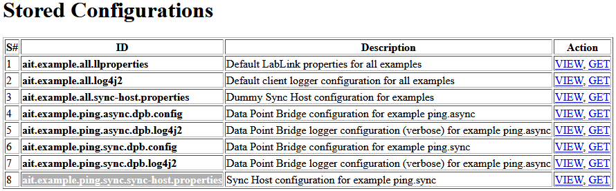

Prerequisites
=============

The following software has to be installed locally:

* **Java Development Kit**: for instance the `Oracle Java SE Development Kit 8 <https://www.oracle.com/technetwork/java/javase/downloads/index.html>`_ or the `OpenJDK <https://openjdk.java.net/>`_
* **MQTT broker**: for instance `Eclipse Mosquitto <https://mosquitto.org/>`_ or `EMQ <http://emqtt.io/>`_

Configure the following environment variables for Java to work properly:

* ensure that the ``JAVA_HOME`` environment variable is set and points to your JDK installation
* ensure that the ``PATH`` environment variable points to your JDK installation's *bin* directory

**TIP (Windows)**:
Add the JDK installation directory to your ``JAVA_HOME`` user environment variable:

#. open the system properties (``WinKey`` + ``Pause`` or go to *Settings* |arrow| *System* |arrow| *About* |arrow| *System Info* |arrow| *Advanced System Settings*)
#. select the *Advanced* tab, then the *Environment Variables* button
#. select and edit the ``JAVA_HOME`` variable in the user variables, e.g., adding *C:\\Program Files\\Java\\jdk-13.0.2*. 

The same dialog can be used to set ``PATH`` to the location of your JDK's *bin* directory, e.g., *C:\\Program Files\\Java\\jdk-13.0.2\\bin*.

.. |arrow| unicode:: U+2192 .. rightwards arrow

Installation
============

Step I: Building the Java package and installing Lablink resources
------------------------------------------------------------------

To build the JAR file for the examples, issue the following command in the root directory of the examples package:

.. code-block:: none

   mvnw clean package

**NOTE**:
This command will start `Maven <https://maven.apache.org/>`_, a build automation tool for Java, in the background.
It will compile the Java source files from subfolder *src* and put all generated outputs in a subfolder called *target*.
The first time you run this script, all dependencies will be copied to your local system, which may take a while and produce a lot of output in your terminal. 
The build process is configured through the `Project Object Model <https://en.wikipedia.org/wiki/Project_Object_Model>`_, which is stored in the :github_blob:`pom.xml` file

By default, this will also retrieve all other Lablink resources that are required to run the examples.
More specifically, the following JAR files are copied to sub-folder *target/dependency*:

* `Configuration Server <https://ait-lablink.readthedocs.io/projects/lablink-config-server>`_: *config-0.0.1-jar-with-dependencies.jar*
* `Datapoint Bridge <https://ait-lablink.readthedocs.io/projects/lablink-datapoint-bridge>`_: *dpbridge-0.0.1-jar-with-dependencies.jar*
* `Simple Sync Host <https://ait-lablink.readthedocs.io/projects/lablink-sync-host)>`_: *sync-0.0.1-jar-with-dependencies.jar*

After successfull installation, also the Javadoc API documentation of the examples package is available (see *index.html* in subfolder *target/site/apidocs*).

Step II: Starting the configuration server
------------------------------------------

Start the configuration server by executing script :github_blob:`run_config.cmd <scripts/0_config/run_config.cmd>` in subfolder :github_tree:`scripts/0_config`.
This will make the content of database file *examples-config.db* available via http://localhost:10101.

**NOTE**:
Once the server is running, you can view the available configurations in a web browser via http://localhost:10101, see below.

**TIP**:
A convenient tool for viewing the content of the database file (and editing it for experimenting with the examples) is `DB Browser for SQLite <https://sqlitebrowser.org/>`_.
